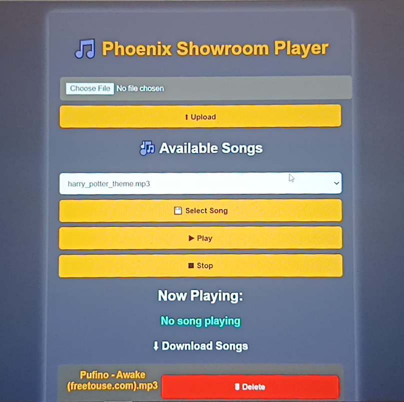

# Kids-Audio-Project 🔊

This project delivered a fully wireless, interactive audio system for the showroom, providing a fun, configurable "toy" for children. The system connects 10 separate play buttons around the showroom to a central server, allowing staff to easily upload and manage custom audio tracks.

|  | Role | Key Feature |
| :--- | :--- | :--- |
| **Server** | Raspberry Pi 4 (Python + Flask) | Central audio storage, web management UI, and background playback. |
| **Clients** | 10x ESP8266 Wi-Fi Modules (C++) | Wireless button control, MQTT command transmission, and Wi-Fi stability. |
| **Communication** | MQTT Broker & HTTP/REST | Reliable, low-latency communication for button press events and file management. |
| **Innovation** | Multithreading (Python) | Ensures audio playback is non-blocking, allowing the server to handle simultaneous requests. |

### 📸 Project Showcase & Prototype Testing

### 💻 Technical Implementation & Architecture

I was responsible for the entire system design, development, and implementation, bridging the hardware and server-side logic.

#### 1. Embedded Client Logic (ESP8266)
The 10 client modules were programmed in C++ to provide reliable, low-latency input using MQTT.

* **Libraries Used:** `ESP8266WiFi.h`, `PubSubClient.h (MQTT)`, `ESP8266HTTPClient.h`.

* **Critical Solutions Implemented:**

  **Button Debouncing & Interrupts:** Software debouncing logic was successfully integrated with hardware interrupts and timing filters to eliminate multiple signals from a single mechanical press, ensuring reliable input. Smart Toggling: Redesigned the button handler logic to toggle between play/pause on a single press, preventing the music from restarting unnecessarily. Wi-Fi Stability: Integrated connection checks and retry logic to ensure the 10 remote units maintained persistent connections in the showroom environment.

#### 2. Central Server & Non-Blocking Playback (Python/Flask)

The Raspberry Pi server manages all audio resources and provides the control interface, leveraging concurrency for high responsiveness.

* **Frameworks Used:** `Flask` (Web framework), `pygame` (Audio playback).
* **Server Libraries:** `os` (File Management), `threading` (Background execution).

* **Multithreading Implementation:**
    The core challenge of audio playback blocking the web server was resolved by starting music in a separate thread. This ensures Flask routes remain unblocked and instantly responsive to uploads or button commands while music is playing.

    ```python
    threading.Thread(target=play_music).start()
    ```

#### 3. 🖥️ Web User Interface (UI)
I designed a simple, intuitive web interface using Flask's `render_template` functionality to allow non-technical showroom staff to manage the system easily.

* **Functionality:** Upload new MP3s, Delete existing songs, and Assign a specific song to any of the 10 play button positions.

### 📈 Outcomes and Future Scope

* **Prototype Testing**


* **Web UserInterface**



#### Outcomes and Results
* **Reliability:** System prototype worked reliably with all 10 simulated play button clients functioning independently.
* **Latency:** Achieved a button-press-to-audio-start delay of less than 0.5 seconds, ensuring a smooth user experience.
* **Seamless Control:** The multithreading solution allowed the mechanical buttons and the web UI controls to work seamlessly without conflicts or freezing.

#### Future Work

* Integration of high-quality speakers instead of the prototype earphones.
* Adding LED lights for visual feedback upon button activation.
* Designing and manufacturing attractive, durable outer casings for each remote play button unit.


### 🧠 Knowledge Gained
* **Full-Stack IoT Architecture:** Gained expertise in integrating C++ (Embedded) and Python (Server) using **MQTT** and **HTTP** protocols.

* **Microcontroller Expertise:** Applied advanced programming concepts like **interrupts** and **debouncing** for robust hardware handling.

* **Concurrent Programming:** Mastered the use of Python's **threading** to ensure non-blocking, responsive server performance under simultaneous loads.

### 👥 Acknowledging
This system was developed as part of an internship project within a professional industrial setting. The success of this project was made possible by the guidance and support of the Automation Engineering team of Phoenix Industries Ltd, Makandura, Sri Lanka.

## 📄 License & Copyright
This project was developed during an internship at Phoenix Industries.
All rights to the design, documentation, and software are owned by Phoenix Industries.
